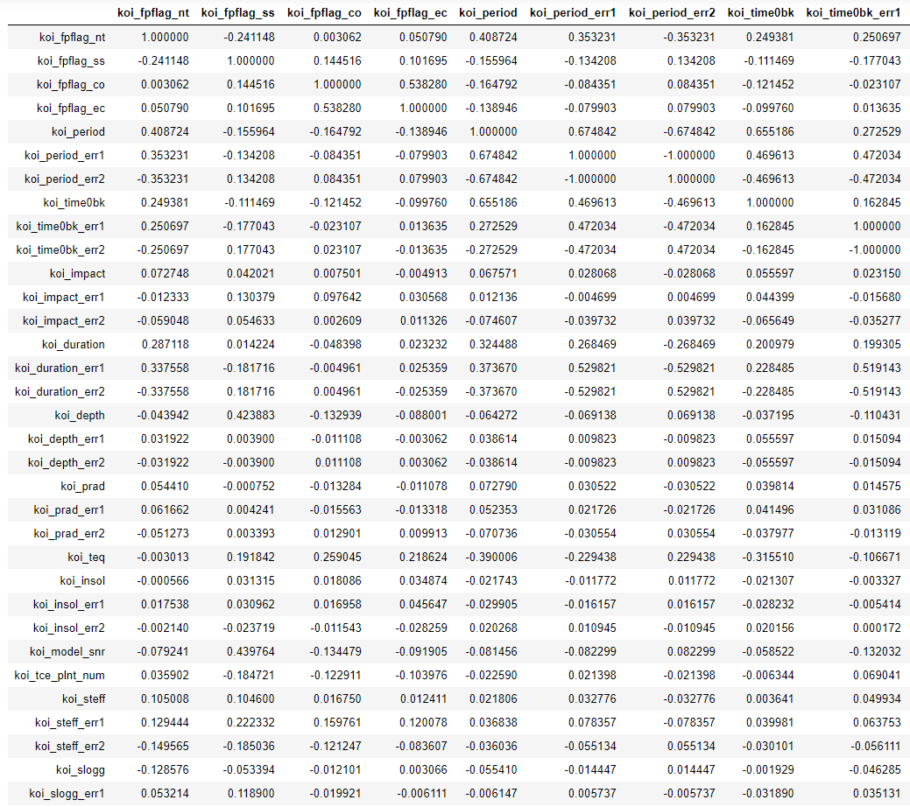
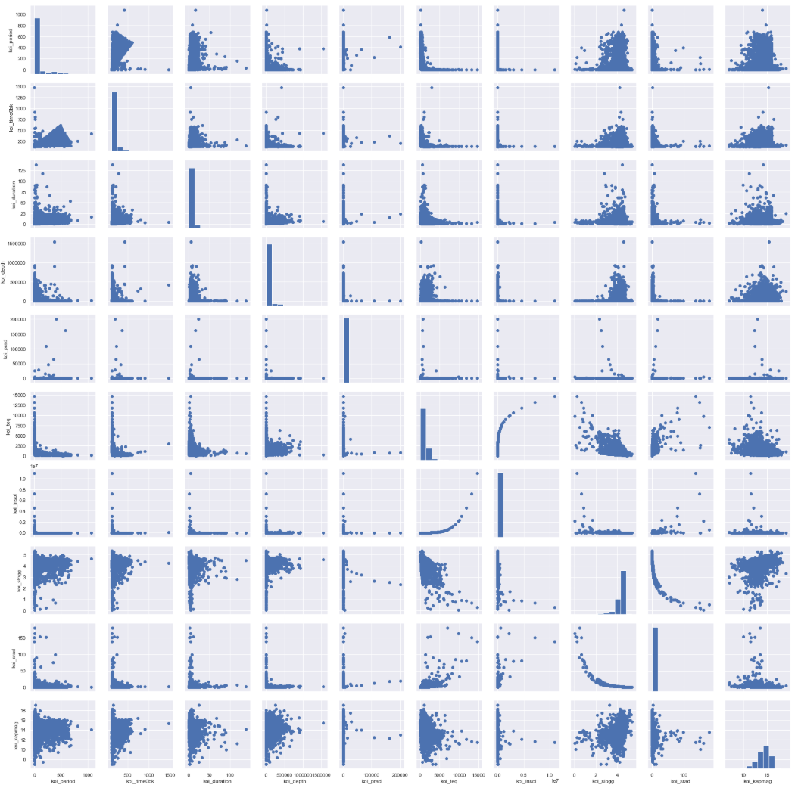
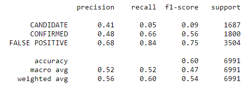
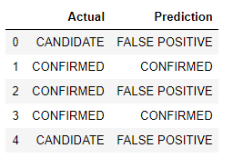
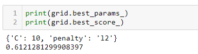
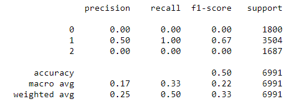
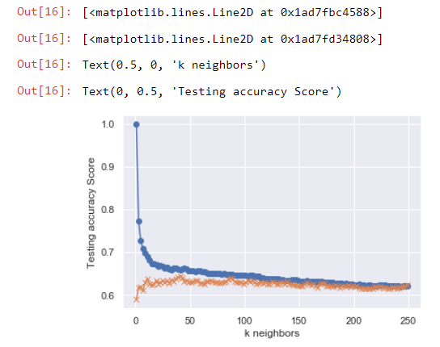
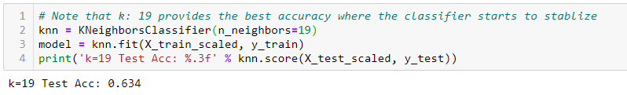

# Exoplanet Exploration
## Machine Learning Challenge

## Background & Scope
 
For more than nine years in deep space, the NASA Kepler space telescope has been out on a planet-hunting mission to discover hidden planets outside of our solar system.
To help process this data, I created 2 machine learning models capable of classifying candidate exoplanets from the raw dataset.
I followed the following steps:

    * Preprocess the raw data
    * Tune the models
    * Compare two or more models

### Data sources
* https://www.kaggle.com/nasa/kepler-exoplanet-search-results
* https://exoplanetarchive.ipac.caltech.edu/docs/API_kepcandidate_columns.html

## Screenshots from data pre-processing and tuning

### Principal Components Analysis

### Pairplot Displays

## Model 1: Logistic Regression 

### Classification Report

### Model Results: KOI Disposition Actual vs. Predicted

### Best scores for the current model

## Model 2: K Nearest Neighbors 

#### Classification Report

#### KNN Plot

### Best scores for the current model
